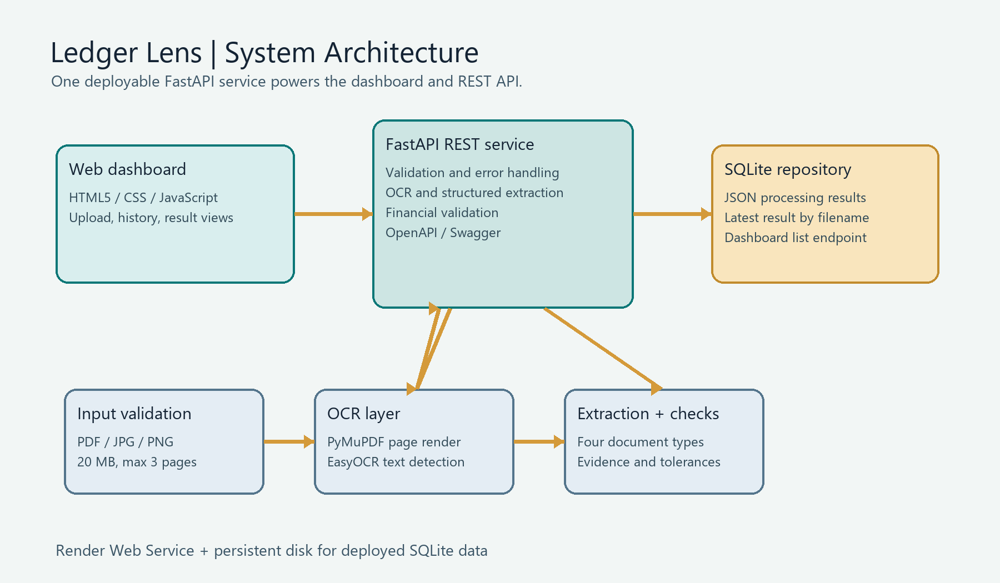

# Intelligent Document Intelligence Platform - Architecture

## System Architecture Overview



```
                               ┌────────────────────────────────┐
                               │  Web Dashboard / Frontend UI   │
                               │  (HTML5 / Vanilla CSS / JS)    │
                               └───────────────┬────────────────┘
                                               │ HTTP Multipart / REST API
                                               ▼
┌─────────────────────────────────────────────────────────────────────────────────────────────┐
│ Fast API REST Service (backend/app/main.py)                                                  │
│                                                                                             │
│ ┌──────────────────────────────────────┐     ┌────────────────────────────────────────────┐ │
│ │ Document Validation Service          │     │ OCR Service (EasyOCR + PyMuPDF)             │ │
│ │ (File integrity, type & page count)  │ ──► │ (Image rendering, spatial text extraction) │ │
│ └──────────────────────────────────────┘     └─────────────────────┬──────────────────────┘ │
│                                                                    │                        │
│ ┌──────────────────────────────────────┐     ┌─────────────────────▼──────────────────────┐ │
│ │ Financial Validation Service         │     │ Field & Table Extraction Service           │ │
│ │ (Calculation checks & reconciliation)│ ◄── │ (Regex, spatial layout & entity parser)    │ │
│ └──────────────────┬───────────────────┘     └────────────────────────────────────────────┘ │
│                    │                                                                        │
│                    ▼                                                                        │
│ ┌─────────────────────────────────────────────────────────────────────────────────────────┐ │
│ │ Document Repository Layer (SQLite Persistence Database)                                 │ │
│ └─────────────────────────────────────────────────────────────────────────────────────────┘ │
└─────────────────────────────────────────────────────────────────────────────────────────────┘
```

## Modular Components

1. **Document Validation Layer** (`document_validation_service.py`):
   - Validates file format (PDF, JPG, PNG).
   - Checks file size, corrupted content, and enforces a maximum 3-page constraint.

2. **OCR Engine Layer** (`ocr_service.py`):
   - Uses `EasyOCR` (deep learning model) combined with `PyMuPDF` for PDF rendering.
   - Eliminates system dependencies on Tesseract.
   - Sorts spatial bounding boxes top-to-bottom, left-to-right to maintain natural document layout.

3. **Field & Table Extraction Layer** (`extraction_service.py`):
   - Structured parsing for Invoices, Balance Sheets, Profit & Loss, and Cash Flow Statements.
   - Produces grounding `evidence` (`source_text`, `page_number`) and confidence scores.

4. **Financial Validation Engine** (`financial_validation_service.py`):
   - Performs mathematical checks for invoice totals, balance sheet equations ($Assets = Liabilities + Equity$), P&L net income, and Cash Flow reconciliations.

5. **Persistence Layer** (`repositories/document_repository.py` & `database.py`):
   - Stores processed JSON documents in an SQLite database for instant retrieval via GET-by-name and dashboard history listing.
